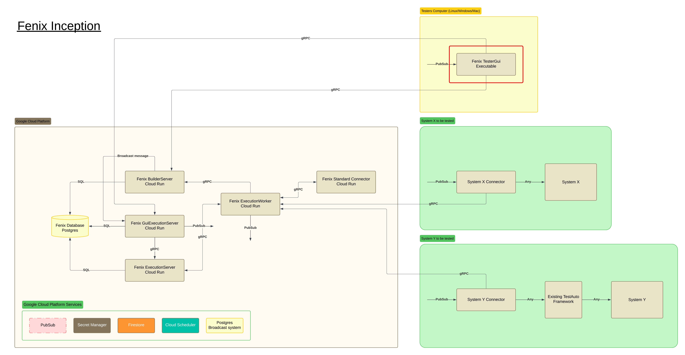

MIT License

Copyright (c) 2024 Jonas Lambert

Permission is hereby granted, free of charge, to any person obtaining a copy of this software and associated documentation files (the "Software"), to deal in the Software without restriction, including without limitation the rights to use, copy, modify, merge, publish, distribute, sublicense, and/or sell copies of the Software, and to permit persons to whom the Software is furnished to do so, subject to the following conditions:

The above copyright notice and this permission notice shall be included in all copies or substantial portions of the Software.

THE SOFTWARE IS PROVIDED "AS IS", WITHOUT WARRANTY OF ANY KIND, EXPRESS OR IMPLIED, INCLUDING BUT NOT LIMITED TO THE WARRANTIES OF MERCHANTABILITY, FITNESS FOR A PARTICULAR PURPOSE AND NONINFRINGEMENT. IN NO EVENT SHALL THE AUTHORS OR COPYRIGHT HOLDERS BE LIABLE FOR ANY CLAIM, DAMAGES OR OTHER LIABILITY, WHETHER IN AN ACTION OF CONTRACT, TORT OR OTHERWISE, ARISING FROM, OUT OF OR IN CONNECTION WITH THE SOFTWARE OR THE USE OR OTHER DEALINGS IN THE SOFTWARE.

***

# Fenix Inception

## TesterGui
TesterGui is the client that the Tester use for building TestCases and TestSuites, control executions and follow up on executions.

TesterGui is a "fat client" and is tested on Ubuntu and Window. Though it should be able to run on Mac.

The following environment variable is needed for TesterGui to be able to run.

| Environment variable                              | Example value                                                           | comment                                                         |
|---------------------------------------------------|-------------------------------------------------------------------------|-----------------------------------------------------------------|
| ApplicationGrpcPort                               | 6668                                                                    | Local gRPC port to trigger some functionality, used for testing |
| AuthClientId                                      | 46368345345345-au53543bleflkfs03423dfs.apps.googleusercontent.com       |                                                                 |
| AuthClientSecret                                  | UYGJIU-KHskjshd7HDK7sdfsdf                                              |                                                                 |
| ExecutionLocationForFenixGuiExecutionServer       | GCP                                                                     | LOCALHOST_NODOCKER, LOCALHOST_DOCKER or GCP                     |
| ExecutionLocationForFenixGuiTestCaseBuilderServer | GCP                                                                     | LOCALHOST_NODOCKER, LOCALHOST_DOCKER or GCP                     |
| ExecutionLocationForThisApplication               | LOCALHOST_NODOCKER                                                      | LOCALHOST_NODOCKER, LOCALHOST_DOCKER or GCP                     |
| FenixGuiExecutionServerAddress                    | fenixguiexecutionserver-must-be-logged-in-ffwegrgwrg-lz.a.run.app       |                                                                 |
| FenixGuiExecutionServerPort                       | 443                                                                     |                                                                 |
| FenixGuiTestCaseBuilderServerAddress              | fenixguitestcasebuilderserver-must-be-logged-in-ffwegrgwrg-lz.a.run.app |                                                                 |
| FYNE_SCALE                                        | 0.8                                                                     | Scale on the screen. Less the 0.8 gives a bad look              |
| FYNE_THEME                                        | dark                                                                    | Dark is the only one that look good                             |
| GCPAuthentication                                 | true                                                                    | Should authentication be used towards GCP                       |
| GcpProject                                        | mycloud-run-project                                                     | GCP project name                                                |
| LocalServiceAccountPath                           | #                                                                       | '#' = not used                                                  |
| ProxyServerURL                                    | #                                                                       | Address tp proxy server, if used                                |
| RunAsTrayApplication                              | NO                                                                      | Not used at all                                                 |
| ShouldProxyServerBeUsed                           | false                                                                   | must a proxy server be used                                     |
| TestExecutionStatusPubSubTopicBase                | TestExecutionStatusTopic                                                |                                                                 |
| UseNativeGcpPubSubClientLibrary                   | true                                                                    |                                                                 |
| UseServiceAccountForGuiExecutionServer            | false                                                                   | When local service account file is used                         |
| UseServiceAccountForGuiTestCaseBuilderServer      | false                                                                   | When local service account file is used                         |

When an executable is created these variables are injected into the executable at build time